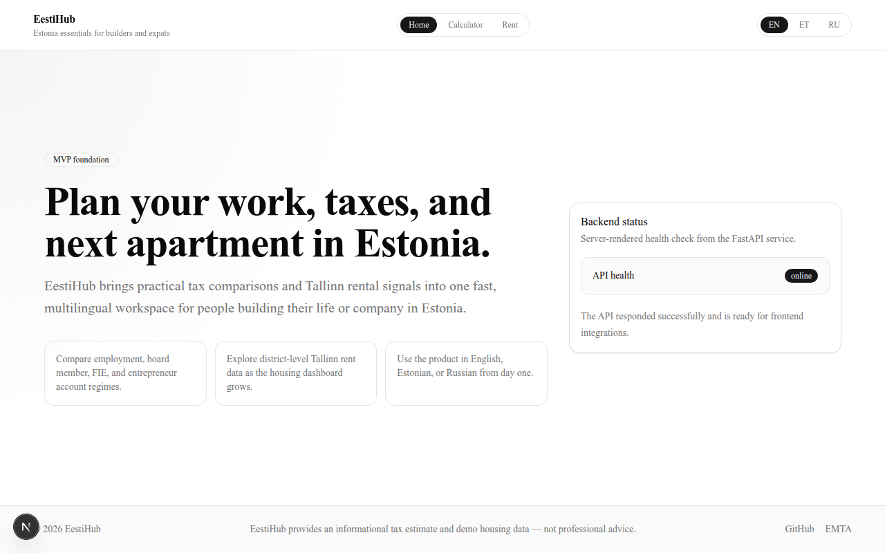
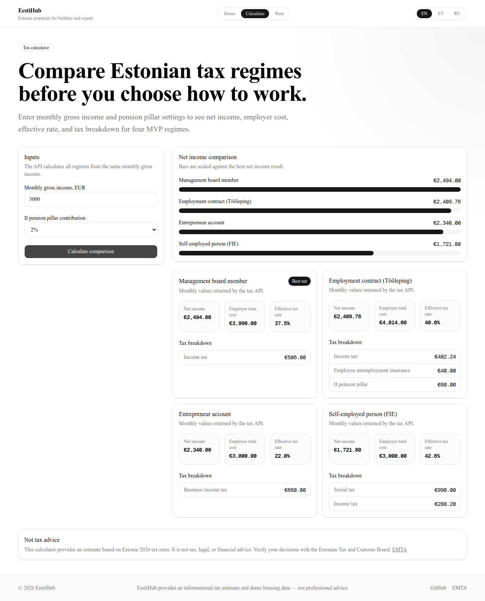
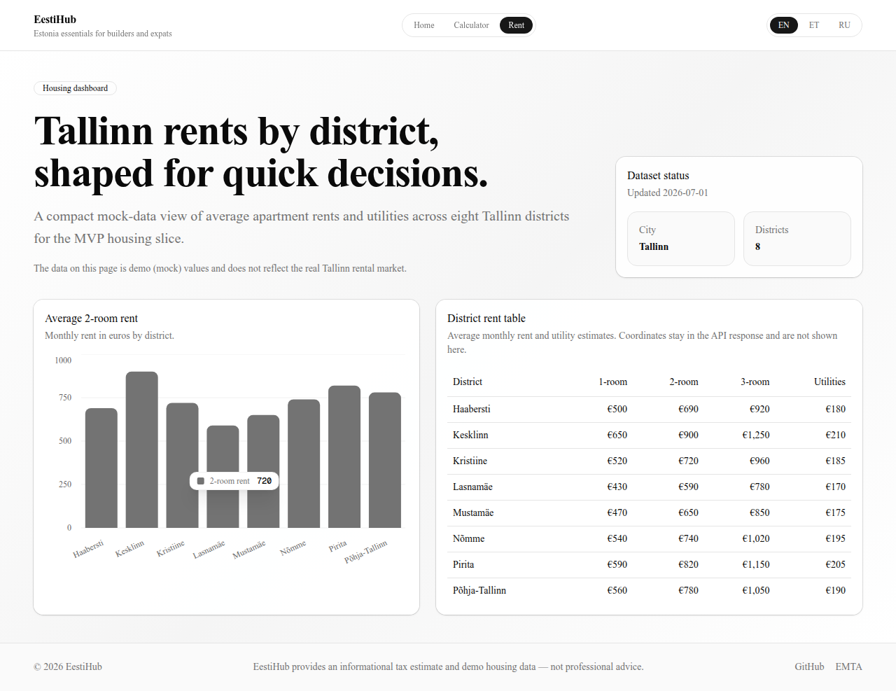

# EestiHub

**Live demo: [eestihub.vercel.app](https://eestihub.vercel.app)** · API docs: [eestihub-api.onrender.com/docs](https://eestihub-api.onrender.com/docs)

[](https://github.com/PavluntiyJ/eestihub/actions/workflows/ci.yml)

Interactive web service for expats and entrepreneurs in Estonia: compare tax regimes, explore Tallinn rent data, all in English, Estonian or Russian.

## Features

- **Tax calculator** — compare net income across four Estonian regimes: employment contract (Tööleping), management board member, FIE sole proprietor, and entrepreneur account. 2026 EMTA rates, employer cost and effective rate breakdown included.
- **Housing dashboard** — average rents by Tallinn district (1-/2-/3-room apartments + utilities), chart and table view.
- **Trilingual** — every UI string translated: English, Estonian, Russian. Locale-prefixed routing with `hreflang` alternates and `x-default` for SEO.

## Screenshots

| Home | Calculator | Housing |
|---|---|---|
|  |  |  |

## Architecture

**Monorepo** — Next.js 15 (App Router) + FastAPI + PostgreSQL 16.

```
Backend (Python)                Frontend (TypeScript)
─────────────────              ─────────────────────
FastAPI                                          Next.js 15
├── api/v1/routes/  thin          ├── src/app/           App Router pages
├── services/       business      ├── features/          calculator, housing
├── schemas/        Pydantic      ├── components/ui/     shadcn/ui
├── models/         SQLAlchemy    ├── types/             1:1 Pydantic mirrors
└── core/           config, tax   └── messages/          en, et, ru
```

The frontend fetches the backend at `/api/v1/` via typed `lib/api.ts`. Backend types are mirrored 1:1 in `frontend/src/types/`. Pages are Server Components; `'use client'` only on interactive leaves (forms, charts, language switcher). All UI strings live in dictionaries — no hardcoded strings in components.

## Getting started

```bash
docker compose up -d db                      # Postgres on :5432
cd backend && python -m scripts.seed_housing # seed housing data
cd backend && uvicorn app.main:app --reload  # API on :8000
cd frontend && npm run dev                   # UI on :3000
```

The frontend reaches the backend via `NEXT_PUBLIC_API_URL` (default `http://localhost:8000`, configured in `frontend/.env.example`).

## Testing

```bash
cd backend && pytest                 # unit + integration tests
cd frontend && npm run e2e           # Playwright chromium smokes (needs backend on :8000)
```

Backend tests (17) cover the health endpoint, tax service arithmetic and the housing API. The Playwright suite (6 browser tests) covers redirect/home, language switch, header nav active state, calculator submit, housing table and chart rendering, and disabled submit on invalid input.

## Deployment

The project is configured for free-tier hosting: Vercel Hobby (frontend), Render Free (backend), and Neon Free (PostgreSQL). The repo includes a Render Blueprint (`render.yaml`), a keep-alive cron workflow (`.github/workflows/keepalive.yml`), and a step-by-step deploy runbook — see [docs/DEPLOY.md](docs/DEPLOY.md).

## Project structure

```
new_site_project/
├── .github/workflows/ci.yml
├── backend/
│   ├── app/
│   │   ├── api/v1/routes/      # health, taxes, housing
│   │   ├── core/               # config, tax_rates, db
│   │   ├── schemas/            # Pydantic request/response
│   │   ├── services/           # tax_service, housing_service
│   │   └── models/             # SQLAlchemy
│   ├── scripts/                # seed_housing
│   └── tests/
├── frontend/
│   ├── src/
│   │   ├── app/[locale]/       # pages + layout
│   │   ├── components/         # ui kit, header, footer
│   │   ├── features/           # tax-calculator, housing
│   │   ├── i18n/               # routing, request config
│   │   ├── lib/                # API client, utils
│   │   ├── messages/           # en, et, ru dictionaries
│   │   └── types/              # 1:1 Pydantic mirrors
│   ├── e2e/                    # Playwright smokes
│   └── scripts/                # screenshots.ts (manual)
├── docs/
│   ├── CONTEXT.md
│   └── screenshots/
├── docker-compose.yml
├── LICENSE
└── README.md
```

## License

MIT — see [LICENSE](LICENSE).
