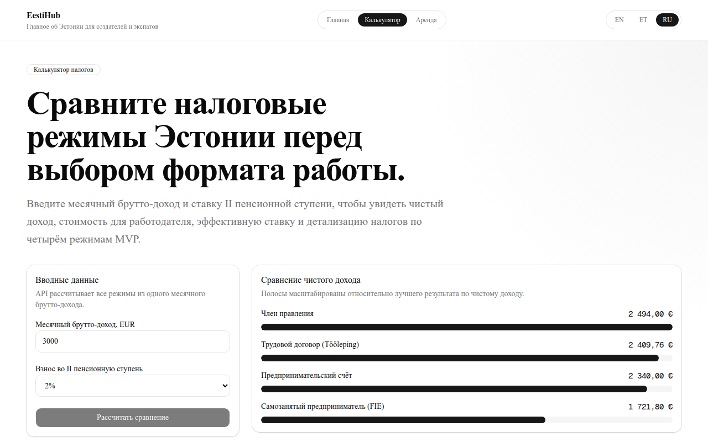

# EestiHub

**Live demo: [eestihub.vercel.app](https://eestihub.vercel.app)** · API docs: [eestihub-api.onrender.com/docs](https://eestihub-api.onrender.com/docs)

[](https://github.com/PavluntiyJ/eestihub/actions/workflows/ci.yml)


Web service for expats and entrepreneurs in Estonia. Moving to Estonia (or opening a business there) means choosing how to get paid — employment contract, board member, sole proprietor, or entrepreneur account — and the difference in take-home pay between them can reach hundreds of euros a month on the same gross income. EestiHub shows that difference in ten seconds, in English, Estonian, or Russian.


## Features

- **Tax regime calculator** — enter gross monthly income and II pension pillar rate, get net income, employer total cost, effective tax rate, and a full tax breakdown for four regimes: employment contract (Tööleping), management board member, FIE sole proprietor, and entrepreneur account. Rates are the 2026 EMTA figures, kept in [one source-annotated module](backend/app/core/tax_rates.py).
- **Tallinn rent dashboard** — average 1/2/3-room rents and utilities across eight districts, table + chart (demo data for now).
- **Trilingual by design** — every UI string comes from en/et/ru dictionaries; locale-prefixed routing with `hreflang` alternates, `x-default`, sitemap, and OG metadata.

| Russian locale, live calculation | Housing dashboard |
|---|---|
|  |  |

## How this repo was built

This project doubles as a case study in **AI-orchestrated development**. A tech-lead agent (Claude) owned the architecture, wrote self-contained task briefs, and reviewed every delivery against explicit acceptance criteria; the application code was written by several AI worker models (GPT, DeepSeek) executing those briefs. The full process is public in this repo:

- [`docs/CONTEXT.md`](docs/CONTEXT.md) — the single source of truth workers had to follow: stack, code rules, API contracts, tax logic.
- [`tasks/`](tasks/) — 13 task briefs with goals, non-goals, and acceptance criteria.
- [`TODO.md`](TODO.md) — the task board and a review journal recording every acceptance, rework, and found bug (including a real tax-rate bug caught at review against the primary EMTA source).

## Architecture

**Monorepo** — Next.js 15 (App Router) + FastAPI + PostgreSQL 16.

```
Backend (Python)                  Frontend (TypeScript)
────────────────                  ─────────────────────
FastAPI                           Next.js 15
├── api/v1/routes/  thin routes   ├── src/app/           App Router pages
├── services/       business      ├── features/          calculator, housing
├── schemas/        Pydantic      ├── components/ui/     shadcn/ui
├── models/         SQLAlchemy    ├── types/             1:1 Pydantic mirrors
└── core/           config, tax   └── messages/          en, et, ru
```

Principles the codebase holds throughout:

- Routes are thin; all tax math lives in the service layer with unit-tested manual derivations.
- Backend Pydantic schemas are mirrored 1:1 (snake_case) in `frontend/src/types/` — the API is locale-neutral, UI labels come only from dictionaries.
- Pages are Server Components; `'use client'` appears only on interactive leaves (form, chart, language switcher).
- Tax rates exist in exactly one file, each constant annotated with its official source.

## Getting started

```bash
docker compose up -d db                      # Postgres on :5432
cd backend && python -m scripts.seed_housing # seed housing data
cd backend && uvicorn app.main:app --reload  # API on :8000
cd frontend && npm run dev                   # UI on :3000
```

The frontend reaches the backend via `NEXT_PUBLIC_API_URL` (default `http://localhost:8000`, configured in `frontend/.env.example`).

## Testing

```bash
cd backend && pytest                 # unit + integration tests
cd frontend && npm run e2e           # Playwright chromium smokes (needs backend on :8000)
```

Backend tests (17) cover the health endpoint, tax service arithmetic and the housing API. The Playwright suite (6 browser tests) covers redirect/home, language switch, header nav active state, a real calculator submit, housing table and chart rendering, and disabled submit on invalid input. CI runs all of it — pytest, production build, and browser e2e against a live Postgres — on every push.

## Deployment

Live on free tiers: Vercel Hobby (frontend), Render Free (backend, kept warm by a [cron ping](.github/workflows/keepalive.yml)), Neon Free (PostgreSQL). The repo includes a Render Blueprint (`render.yaml`) and a step-by-step runbook — see [docs/DEPLOY.md](docs/DEPLOY.md).

## Project structure

```
├── .github/workflows/          # ci.yml, keepalive.yml
├── backend/
│   ├── app/
│   │   ├── api/v1/routes/      # health, taxes, housing
│   │   ├── core/               # config, tax_rates, db
│   │   ├── schemas/            # Pydantic request/response
│   │   ├── services/           # tax_service, housing_service
│   │   └── models/             # SQLAlchemy
│   ├── scripts/                # seed_housing
│   └── tests/
├── frontend/
│   ├── src/
│   │   ├── app/[locale]/       # pages + layout
│   │   ├── components/         # ui kit, header, footer
│   │   ├── features/           # tax-calculator, housing
│   │   ├── i18n/               # routing, request config
│   │   ├── lib/                # API client, utils
│   │   ├── messages/           # en, et, ru dictionaries
│   │   └── types/              # 1:1 Pydantic mirrors
│   ├── e2e/                    # Playwright smokes
│   └── scripts/                # screenshots.ts (manual)
├── docs/                       # CONTEXT.md, DEPLOY.md, screenshots
├── tasks/                      # AI-worker task briefs (T01–T13)
├── TODO.md                     # task board + review journal
├── docker-compose.yml
└── render.yaml
```

## Disclaimer

The calculator provides estimates based on Estonia's 2026 tax rates and is not tax advice — verify decisions with [EMTA](https://www.emta.ee/en). Housing figures are demo data.

## License

MIT — see [LICENSE](LICENSE).
