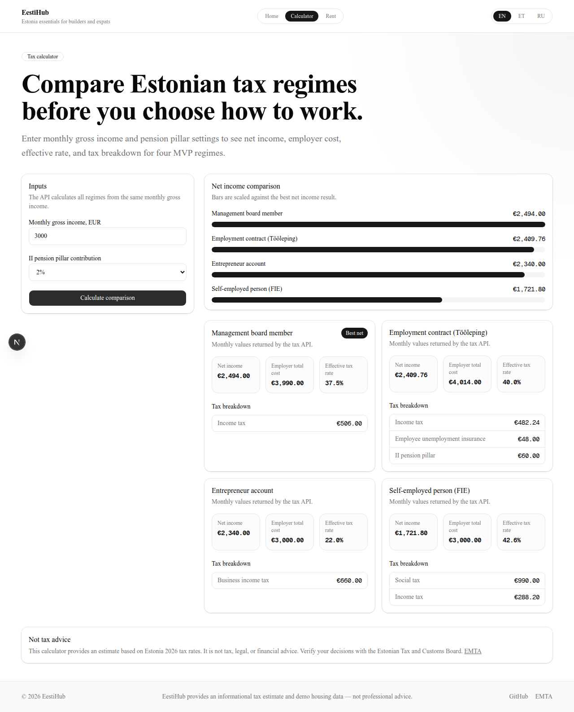
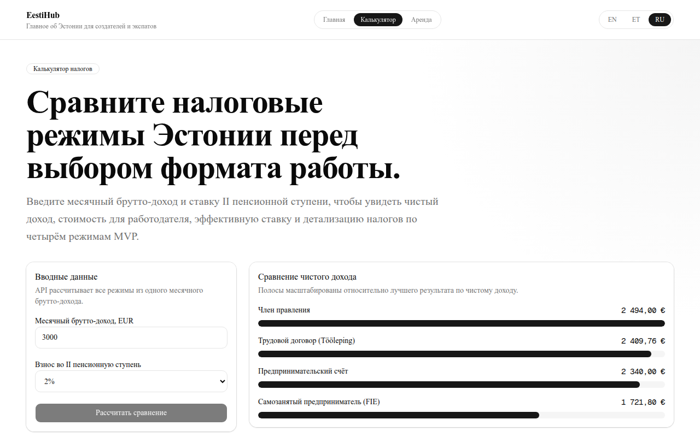
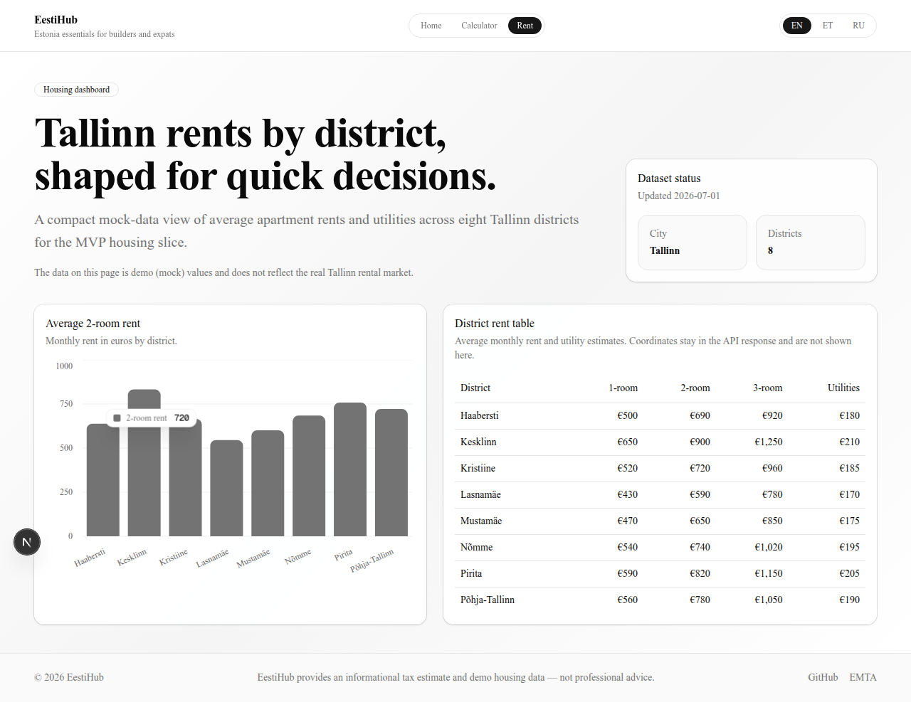

# EestiHub

**Live demo: [eestihub.vercel.app](https://eestihub.vercel.app)** · API docs: [eestihub-api.onrender.com/docs](https://eestihub-api.onrender.com/docs)

[](https://github.com/PavluntiyJ/eestihub/actions/workflows/ci.yml)


Web service for expats and entrepreneurs in Estonia. Moving to Estonia (or opening a business there) means choosing how to get paid — employment contract, board member, sole proprietor, or entrepreneur account — and the difference in take-home pay between them can reach hundreds of euros a month on the same gross income. EestiHub shows that difference in ten seconds, in English, Estonian, or Russian.



## Features

- **Tax regime calculator** — enter gross monthly income and II pension pillar rate, get net income, employer total cost, effective tax rate, and a full tax breakdown for four regimes: employment contract (Tööleping), management board member, FIE sole proprietor, and entrepreneur account. Rates are the 2026 EMTA figures, kept in [one source-annotated module](backend/app/core/tax_rates.py).
- **Comparison basis** — the four regimes cost the payer different amounts for the same gross, so ranking them by net income is only meaningful once you fix what they have in common. Switch between equal gross and equal cost to the payer; at €3,000 the ranking inverts.
- **Statutory limits, surfaced** — the €40,000 entrepreneur-account ceiling, the VAT registration threshold and the FIE social-tax floor and cap come back as machine-readable constraints instead of being left for the user to discover.
- **Tallinn rent dashboard** — average 1/2/3-room rents and utilities across eight districts, table + chart. Values are midpoints of published district rent ranges from a public Tallinn market report, cited with retrieval date in [`backend/scripts/data/SOURCES.md`](backend/scripts/data/SOURCES.md); a trends endpoint serves the snapshot history.
- **Affordability link** — after a calculation, which districts you could actually rent in, matched on rent plus utilities against an adjustable share of net income.
- **e-Residency cost calculator** — setup fees, monthly running cost, first-year total and break-even revenue for an e-resident OÜ, every constant traced to an official source.
- **Budget planner** — employment salary (converted with the 2026 tax engine, never the highest-net regime) or manual net, explicit spending and savings including zero, and an editable housing share. The API returns net income, both budget limits, the final allowance and machine-readable warnings; the UI aborts obsolete requests, marks edited results stale, preserves inputs on errors, and never puts salaries in URLs or storage.
- **Tallinn address search** — a debounced, keyboard-operable combobox on the planner page backed by the In-AKS gazetteer: up to eight Tallinn candidates with coordinates and match quality, selectable as location context only. No persistence, no map dependency; provider outages keep the budget intact.
- **Shareable scenarios** — calculator state lives in the URL, and a shared link arrives with its numbers already rendered server-side.
- **Trilingual by design** — every UI string comes from en/et/ru dictionaries; locale-prefixed routing with absolute `hreflang` alternates, `x-default`, sitemap, and generated per-locale OG cards. Light, dark and system themes.
- **Accessibility as a gate** — skip link, real landmarks, labelled controls and error associations; 12 axe scans (WCAG 2.0/2.1/2.2 A/AA plus best practices) cover every page, calculated results, a negative-net state, the planner and address flows and both themes, and fail CI on any violation.
- **Containerised stack** — `docker compose up --build` builds the frontend and API images, starts Postgres, seeds the sourced housing data and serves the app on :3000. CI builds the images and smoke-tests the running stack.

| Russian locale, live calculation | Housing dashboard |
|---|---|
|  |  |

## API

Locale-neutral: responses carry machine keys and numbers, human labels come from the frontend dictionaries. Interactive docs at [`/docs`](https://eestihub-api.onrender.com/docs).

| Endpoint | Purpose |
|---|---|
| `GET /api/v1/health` | Liveness plus a real database probe; 503 when the query fails |
| `POST /api/v1/calculate-taxes` | Net income, payer cost, effective rate, breakdown and statutory constraints for the four regimes |
| `GET /api/v1/housing/rents` | Latest rent snapshot per Tallinn district |
| `GET /api/v1/housing/trends` | Snapshot history per district |
| `POST /api/v1/calculate-eresidency` | First-year cost of an e-resident OÜ |
| `POST /api/v1/planner/budget` | Monthly housing allowance from employment or manual net, spending, savings and a housing share |
| `GET /api/v1/addresses/search` | Up to eight Tallinn address candidates with coordinates and match quality |

The full contract, including the tax logic and its sources, is in [`docs/CONTEXT.md`](docs/CONTEXT.md).

## How this repo was built

This project doubles as a case study in **AI-orchestrated development**. A tech-lead agent (Claude) owned the architecture, wrote self-contained task briefs, and reviewed every delivery against explicit acceptance criteria; the application code was written by several AI worker models (GPT, DeepSeek) executing those briefs. The full process is public in this repo:

- [`docs/CONTEXT.md`](docs/CONTEXT.md) — the single source of truth workers had to follow: stack, code rules, API contracts, tax logic.
- [`docs/AI-WORKFLOW.md`](docs/AI-WORKFLOW.md) — the workflow in full: roles, artifacts, the review loop, and what the process actually caught.
- [`tasks/`](tasks/) — 20 task briefs with goals, non-goals, and acceptance criteria.
- [`TODO.md`](TODO.md) — the task board and a review journal recording every acceptance, rework, and found bug — including a tax-rate bug caught at review against the primary EMTA source, and a full code audit whose 20 findings became iteration 7.

## Architecture

**Monorepo** — Next.js 15 (App Router) + FastAPI + PostgreSQL 16.

```
Backend (Python)                  Frontend (TypeScript)
────────────────                  ─────────────────────
FastAPI                           Next.js 15
├── api/v1/routes/  thin routes   ├── src/app/           App Router pages
├── services/       business      ├── features/          calculator, housing, planner
├── schemas/        Pydantic      ├── components/ui/     shadcn/ui
├── models/         SQLAlchemy    ├── types/             1:1 Pydantic mirrors
└── core/           config, tax   └── messages/          en, et, ru
```

Principles the codebase holds throughout:

- Routes are thin; all tax math lives in the service layer with unit-tested manual derivations.
- Backend Pydantic schemas are mirrored 1:1 (snake_case) in `frontend/src/types/` — the API is locale-neutral, UI labels come only from dictionaries.
- Pages are Server Components; `'use client'` appears only on interactive leaves (forms, chart, navigation, language switcher, theme toggle).
- Tax rates exist in exactly one file, each constant annotated with its official source.

## Getting started

With Docker, one command builds and starts the whole stack — Postgres, the
API (seeded on boot) and the frontend:

```bash
docker compose up --build   # UI on :3000, API on :8000
```

For local processes instead of containers:

```bash
docker compose up -d db                      # Postgres on :5432
cd backend && python -m scripts.seed_housing # seed baseline housing data
cd backend && python -m scripts.ingest_rents  # ingest sourced rent snapshots
cd backend && python -m scripts.import_gtfs --validate-only # validate transit feed (no writes)
cd backend && python -m scripts.import_gtfs  # import versioned transit snapshot
cd backend && uvicorn app.main:app --reload  # API on :8000
cd frontend && npm run dev                   # UI on :3000
```

The frontend reaches the backend via `NEXT_PUBLIC_API_URL` (default `http://localhost:8000`, configured in `frontend/.env.example`); inside Docker the server side uses the `API_URL` override so it can reach the API over the compose network.

## Testing

```bash
cd backend && pytest                 # unit + integration tests
cd frontend && npm run e2e           # Playwright chromium smokes (needs backend on :8000)
cd frontend && npm run lighthouse    # Lighthouse CI assertions (needs a running frontend)
```

Backend tests (150) cover the health endpoint, both comparison bases, the FIE social-tax bounds, the statutory constraints, a golden-file regression suite of hand-derived net incomes, the housing snapshot fallback and ingest idempotency, the e-Residency service, the planner budget service (fixtures, allowance boundary, rounding, seasonal logic, move-in cash, employment parity, strict-validation and JSON-safe 422 paths), and the address search adapter (quality mapping, Tallinn filtering, dedup, strict envelopes, malformed rows, cache/limiter behavior, provider-failure and validation envelopes). The Playwright suite (62 browser tests) covers locale routing and switching, real submits on all three calculators, shared scenario URLs, constraint rendering, the affordability panel, the planner flow (employment/manual net, validation, zero amounts, stale-response ordering, retry, keyboard, mobile, draft warning, locales), the address combobox (debounce, keyboard selection, edit invalidation, late responses, timeout retry, empty/unavailable/busy states, locales, mobile, themes), the housing table and chart, plus 12 axe accessibility scans. CI runs all of it — pytest, production build, browser e2e against a live Postgres, Lighthouse assertions, and a Docker Compose smoke of the running stack — on every push.

## Deployment

Live on free tiers: Vercel Hobby (frontend), Render Free (backend — spins down when idle, first request after a pause takes ~1 min), Neon Free (PostgreSQL). The repo includes a Render Blueprint (`render.yaml`) and a step-by-step runbook — see [docs/DEPLOY.md](docs/DEPLOY.md).

## Project structure

```
├── .github/workflows/          # ci.yml: tests, build, e2e, Lighthouse, Docker
├── backend/
│   ├── app/
│   │   ├── api/v1/routes/      # health, taxes, housing, eresidency, planner
│   │   ├── core/               # config, tax_rates, fees, db
│   │   ├── schemas/            # Pydantic request/response
│   │   ├── services/           # tax_service, housing_service, eresidency_service, budget_service
│   │   └── models/             # SQLAlchemy
│   ├── scripts/                # seed_housing, ingest_rents, data/ + SOURCES.md
│   ├── tests/
│   └── Dockerfile
├── frontend/
│   ├── src/
│   │   ├── app/[locale]/       # pages + layout
│   │   ├── components/         # ui kit, header, footer
│   │   ├── features/           # tax-calculator, housing, eresidency, planner
│   │   ├── i18n/               # routing, request config
│   │   ├── lib/                # API client, utils
│   │   ├── messages/           # en, et, ru dictionaries
│   │   └── types/              # 1:1 Pydantic mirrors
│   ├── e2e/                    # smoke.spec.ts, planner.spec.ts + a11y.spec.ts (axe)
│   ├── scripts/                # screenshots.ts (manual)
│   ├── lighthouserc.json       # Lighthouse CI assertions
│   └── Dockerfile
├── docs/                       # CONTEXT.md, AI-WORKFLOW.md, DEPLOY.md, screenshots
├── tasks/                      # AI-worker task briefs (T01–T20)
├── TODO.md                     # task board + review journal
├── docker-compose.yml          # db + api + web
└── render.yaml
```

## Disclaimer

The calculator provides estimates based on Estonia's 2026 tax rates and is not tax advice — verify decisions with [EMTA](https://www.emta.ee/en). Housing figures are midpoints of published district rent ranges, not individual listings; utilities are a separate estimate.

## License

MIT — see [LICENSE](LICENSE).
